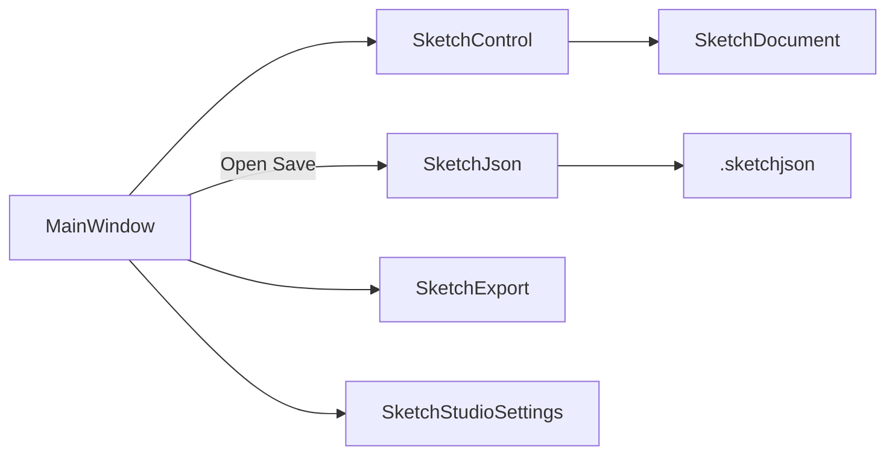

# Architecture

← [Documentation index](README.md) · [Smoke and release](smoke-and-release.md)

## Placement

| Kind | Location |
|------|----------|
| Product host | `novolis-apps/src/SketchStudio` (this app) |
| Sketch engine | Packable `Novolis.Avalonia.Controls.Sketch` |
| Shared dialogs | `Novolis.Avalonia.Controls` (`ChoiceDialog`, …) |
| Dogfood | `novolis-dogfooding/.../SketchLab` |

Follows app-host placement and nuget-only policy: the app uses **PackageReference** to published packages; local iteration uses Platform ProjectReference mode (`-p:NovolisUseProjectReferences=true`), never sibling path refs in the csproj.

## Layering

```text
SketchStudio (Apps)
  ├── Avalonia Desktop / Fluent / Inter
  ├── Novolis.Avalonia.Controls          (dialogs)
  ├── Novolis.Avalonia.Controls.Sketch   (SketchControl, SketchJson, document)
  ├── Novolis.Avalonia.Packaging.Inno    (installer targets)
  └── Optris.Icons (Font Awesome chrome)
```

Gaming / Simulation packages are not involved. Avalonia stays in Apps + Avalonia library layers only.

## Host modules

| Type | Role |
|------|------|
| `Program` | Host DI; `--smoke` early exit; Avalonia bootstrap |
| `App` | FluentTheme light |
| `MainWindow` | Toolbar, files, export, F1, key chords |
| `SketchShortcuts` | Tooltip copy + F1 dialog tables |
| `SketchStudioSettings` | LocalAppData last path + MRU |
| `SketchExport` | PNG / SVG snapshot (not in the package) |
| `SmokeRunner` | Headless document → JSON → export checks |

## Ownership split

| Concern | Owner |
|---------|--------|
| Pointer tools, hit-test, undo, meetup/gridify, JSON model | Controls.Sketch |
| File pickers, dirty title, MRU, F1, opaque PNG policy | Sketch Studio host |
| Wire format documentation | Governance `sketchjson.md` |
| Installer / GitHub Release assets | `novolis-apps` catalog + Packaging.Inno |

## Data flow



## See also

- [UX chrome](ux-chrome.md)
- [Export](export.md)
- Package README: Controls.Sketch
