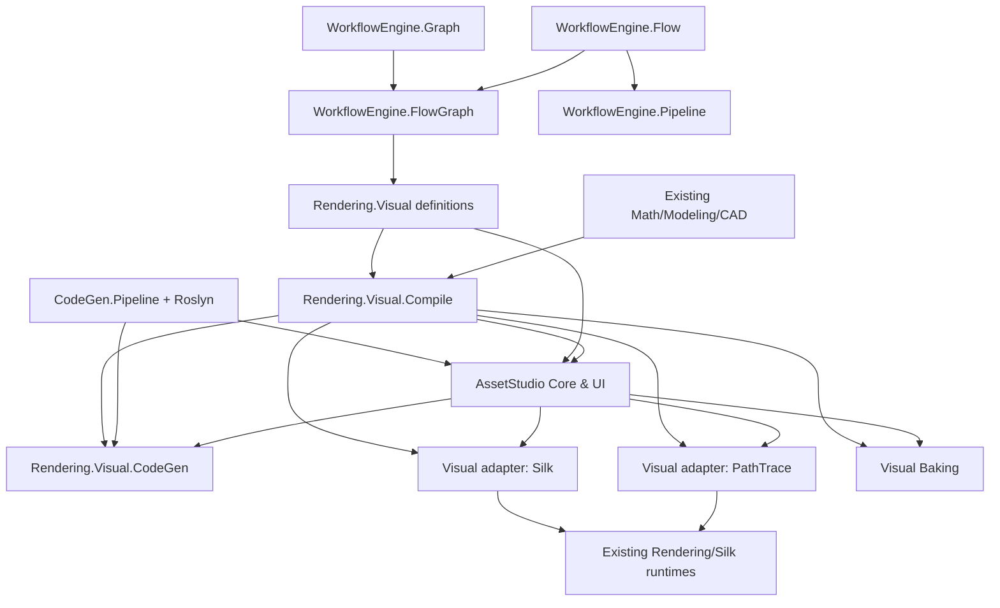
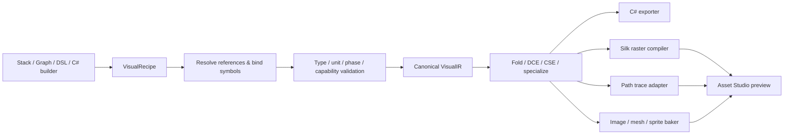

# Novolis Visual Authoring Platform
## Asset Studio · WorkflowEngine rewrite · Rendering integration

**Specification:** V1.0, architecture proposal  
**Date:** 2026-10-11  
**Platform:** .NET 10 / C# 14  
**Status:** Proposed; not a claim that proposed packages/APIs exist  
**Primary success criterion:** A user visually constructs a procedural bulkhead, previews it, generates compilable C# extension methods, and uses those methods in a separate application without Asset Studio, source JSON, loose textures, or a graph interpreter at runtime.

---

## 0. Executive summary

Novolis Asset Studio is a **code-first visual-content compiler and workbench**. Its input is a reusable typed **visual recipe**. Its authoring representations are a stack, a node graph, a textual DSL, and a property inspector. Its outputs are ordinary C#, compiled/baked assets, or serializable data. All authoring views operate on a single semantic graph. A code-only consumer links stable runtime packages, not the editor.

There are three workstreams:

1. **`AssetStudio`**: authoring UX, live preview, import/slicing, inspectors, source/graph synchronization, compilation orchestration, exports, project/session integration.
2. **`WorkflowEngine` rewrite**: renderer-independent graph topology, typed flow semantics, linear pipeline, graph-shaped flow, projection/layout and optional execution. Continue supporting existing named manually-invokable workflows.
3. **Rendering pipeline components for Asset Studio**: shared procedural visual contracts, typed stage boundaries, geometry-to-mesh compilation, field/surface evaluation, lighting/effects/frame adapters, raster preview and ray-tracer compilation bridges.

The core promise is **definitions first, artifacts optional**. “Assetless” means no *required external image/texture/data resources at runtime* for the code-only target. It does not mean banning GPU buffers, shaders, procedural textures, rasterization, or generated binary data inside an assembly.

### 0.1 Product principles

- **One semantic representation**: Stack/UI/DSL/C# are projections; a graph owns meaning. Generated C# is an output, not an unrestricted canonical source editor.
- **Reusable kernels**: Graph has no visual concepts. Rendering has no Asset Studio UI concepts. Asset Studio does not define core renderer contracts.
- **Typed stage boundaries**: Geometry, mesh, surface, assembled object, scene, volume/effect and frame are not interchangeable.
- **Build-time sophistication, runtime simplicity**: Normalize, validate, specialize, fold constants, eliminate dead nodes and generate code before deployment when possible.
- **True cost model**: Meshing, GPU upload, material shader compilation, ray-tracing BVH compilation, per-frame updates and full-frame passes are separate operations.
- **Determinism where applicable**: Seeded procedural nodes, stable output ordering, controlled numeric precision, deterministic CPU reference evaluation. GPU cross-vendor pixel identity is *not* promised.
- **Transparency about capability**: Silk/raster and Rendering/path tracing may produce different approximations; never imply they have the same PBR, shadow or volume implementation.
- **No duplicated scene model**: Reuse existing Novolis math/CAD/modeling/scene contracts through adapters.
- **UI-first and code-first**: Both can create valid recipes, but arbitrary hand-written C# cannot generally be reverse-converted to a graph.

### 0.2 Reference implementations / grounded existing capabilities

Verified through publicly accessible Novolis documentation, not a full source-level audit:

- `Novolis.CodeGen.Pipeline`: linear `IPipelineStep`/`IPipelineLayout` orchestration, input/output path fingerprints, skip/cache, `step.log` and `result.json`.
- `Novolis.CodeGen.Bindings.Roslyn`, reflection helpers and dump tools: existing Roslyn-oriented generation and object-to-C# facilities.
- `Novolis.Rendering`: `Scene + IMaterial → SceneCompiler → CompiledScene → IRayTracingBackend → IRenderOutput → IFramePresenter`, CPU/ILGPU/Vulkan backends, ray materials, Silk/Raylib presenters, host-neutral 2D model and TwoD.Silk backend.
- `Novolis.WorkflowEngine`: currently published as named, manually invokable workflow pipelines for .NET apps. A rewrite must preserve that usage via compatibility adapters.
- The completed Novolis C4D-lite/Avalonia 3D planning documentation describes `Novolis.Modeling.Scene`/`SceneDocument`, typed generator/modifier/material/light nodes, staged scene evaluation, `Novolis.Avalonia.3D`, and LightLab. Treat as *intended integration seam*; verify live implementation before changing a project.
- Earlier discussion described Silk `GlHost` unlit/blit/planar facilities; their precise current API is **not independently verified**, so render adapters must inventory actual runtime contracts before implementation.

**Research sources** (public URLs; revalidate at implementation time):

- https://github.com/Novolis-Platform/novolis-rendering
- https://github.com/Novolis-Platform/novolis-codegen
- https://github.com/Novolis-Platform/novolis-codegen/blob/main/src/Novolis.CodeGen.Pipeline/README.md
- https://www.nuget.org/profiles/Novolis?page=2
- https://novolis-platform.github.io/.github/novolis-governance/completed-plans/avalonia_3d_cinemalight_d2ad4ea5.plan.html
- https://novolis-platform.github.io/.github/novolis-governance/completed-plans/binding_codegen_library_edbc29d0.plan.html

---

## 1. Vocabulary and ownership

| Term | Defined meaning | Owner |
|---|---|---|
| `Graph` | Structural nodes and directed edges; no execution | WorkflowEngine.Graph |
| `Flow` | Typed values/control conveyed through ports; no prescribed topology | WorkflowEngine.Flow |
| `Pipeline` | Ordered linear composition of stages | WorkflowEngine.Pipeline |
| `FlowGraph` | A flow connected using graph topology | WorkflowEngine.FlowGraph |
| `VisualRecipe` | Versioned, typed, serializable visual definition using a FlowGraph | Rendering.Visual / Visual.Definitions |
| `VisualIR` | Validated, normalized target-neutral representation of a recipe | Rendering.Visual.Compile |
| `Shape` / `Geometry` | Parametric/semantic geometry before tessellation | Math/Modeling/CAD, adapted by Rendering.Visual |
| `Mesh` | Vertices/indices/topology plus required attributes | Existing math/modeling mesh owner; renderer adapter |
| `Surface` | How a surface appears/reacts to light, without scene effects | Rendering.Visual |
| `VisualAssembly` | Composition of geometry/mesh, surface bindings, optional emitted components | Rendering.Visual |
| `Scene` | Instances, transforms, lights, camera, volumes; use existing model | Modeling.Scene / Rendering.Scene adapters |
| `RenderPass` | GPU/frame operation involving attachments/resources | Rendering-specific frame-graph API, *not* generic FlowGraph execution |
| `Bake` | Evaluate/compile an authored definition into fixed images/meshes/data | AssetStudio.Export and rendering compiler backends |
| `CodeExport` | Deterministically generated C# referencing stable Novolis runtime APIs | AssetStudio.CodeGen / CodeGen integrations |

### 1.1 Distinguish three kinds of pipelines

1. **Visual dependency graph**: `Noise → Multiply → Roughness`. This is declarative dataflow, usually compiled rather than executed node-by-node in a game.
2. **Offline build pipeline**: `Parse → Validate → Lower → Emit C# → Pack`, which should reuse CodeGen.Pipeline's fingerprint/cache machinery.
3. **Frame/render pass pipeline**: `Opaque HDR → Emissive → Bloom → Tonemap → Present`, with GPU resource/state scheduling in a renderer-specific package.

They can all be *visualized using* graph projection infrastructure. They must not share a single runtime execution contract merely because diagrams have arrows.

---

## 2. Package and repository plan

These package names are **proposed**, not declarations of current NuGets. Publish only coherent, stable consumer boundaries; initially some can remain internal projects.

### 2.1 `novolis-workflows` / WorkflowEngine rewrite

- `Novolis.WorkflowEngine.Graph`: immutable graph model, stable IDs, edges, traversal, reachability, SCC/cycle analysis, topological ordering, diff/invalidation helpers.
- `Novolis.WorkflowEngine.Flow`: typed ports, flow node descriptors, input/output connection rules, type compatibility, flow diagnostics, abstract flow semantics. Does **not** require a graph runtime.
- `Novolis.WorkflowEngine.Pipeline`: linear ordered stages and transforms; uses Flow contracts; optional async stage executor. Avoid a mandatory Graph dependency for a simple pipeline.
- `Novolis.WorkflowEngine.FlowGraph`: adapter/composition of Graph + Flow, typed connection validation and dependency analysis; reusable for compile-only visual graphs.
- `Novolis.WorkflowEngine.Graph.Layout` (optional package): layout results, route geometry, orientation and grouping; separate from topology.
- `Novolis.WorkflowEngine.Graph.Export.Mermaid` (optional): textual diagnostic exporter.
- `Novolis.WorkflowEngine.Graph.Export.Svg` (optional): SVG document exporter consuming layout results.
- `Novolis.WorkflowEngine.Execution` (defer until needed): async DAG scheduling for side-effecting jobs, retries/cancellation policies in workflow-specific layer.
- Existing `Novolis.WorkflowEngine`: preserve named manual workflow invocation and DI registration as a façade over a new Pipeline executor; old public API continues via compatibility layer.

**Dependency rule:** Graph and Flow have no reference to Rendering, Avalonia, command parsers, Roslyn or Asset Studio. `FlowGraph → Graph + Flow`. `Pipeline → Flow`. `Graph.Layout → Graph`. `Graph.Export.* → Graph.Layout`.

**Naming decision:** `Novolis.WorkflowEngine.FlowGraph` is accepted as proposed NuGet/package name. Nested namespace `Novolis.WorkflowEngine.Flow.Graph` can be used if consistency requires it, but avoid publishing both as competing concepts.

### 2.2 `novolis-rendering` extensions

- `Novolis.Rendering.Visual`: reusable visual definition primitives, typed fields, surface/light/effect/geometry references, parameter schema, versioned recipes, semantic capabilities. Host- and editor-neutral.
- `Novolis.Rendering.Visual.Compile`: visual semantic binder, compiler passes, IR, diagnostics, target capability negotiation, specialization and incremental invalidation.
- `Novolis.Rendering.Visual.CodeGen`: C# syntax emission for recipes, methods, parameter classes and manifests; depends on stable CodeGen/Roslyn tools as appropriate. Consider hosting this package in the CodeGen repo after API stabilization; avoid circular package dependencies.
- `Novolis.Rendering.Visual.Baking`: deterministic CPU evaluation/baking of fields and textures; use existing CPU renderer for higher-fidelity final image baking when warranted.
- `Novolis.Rendering.Visual.Adapters.PathTrace`: compile supported surface and scene constructs into existing `IMaterial`/`SceneCompiler` inputs. Own feature gaps explicitly.
- `Novolis.Rendering.Visual.Adapters.Silk`: compile supported raster definitions into Silk-compatible shaders, uniforms and drawing state. Place physically in the repository owning the real Silk adapter if that avoids a cross-repo cycle.
- `Novolis.Rendering.FrameGraph` (future): frame resource DAG (HDR attachments, bloom pyramid, depth, pass barriers/state), explicitly *not* `WorkflowEngine.FlowGraph` execution.

Reuse existing `Novolis.Rendering.Materials`, `Novolis.Rendering.Scene`, `.Compile`, `.Runtime`, backends, presentation, `Novolis.Rendering.TwoD` and `Backends.TwoD.Silk`. Do not replace these with Visual types. They remain runtime/target authorities.

### 2.3 Asset Studio

- `Novolis.AssetStudio.Core`: document/session state, edits/commands, workspace snapshots, file save/load, preview requests, services and plugin contracts. No Avalonia references.
- `Novolis.AssetStudio.Avalonia`: editor shell, graph canvas, stack editor, property inspector, source editor integration, preview pane, diagnostics and timeline.
- `Novolis.AssetStudio.Import`: PNG/JPEG/WebP source import (only as user input), sprite cropping/slicing, sprite-sheet packing and mapping, imported mesh/scene adapters.
- `Novolis.AssetStudio.Export`: export orchestration and target configuration for data, code, packed assets, atlases and textures. Source-compatible outputs via Visual.CodeGen.
- `Novolis.AssetStudio.Cli`: headless `validate`, `build`, `generate`, `bake`, `inspect`, `graph`, `diff` commands; same compiler as UI.
- `Novolis.AssetStudio` app: composes all of the above and preview backends. Asset Studio UI is *not* a runtime dependency.

**Reuse before adding:** Novolis Avalonia editor infrastructure; modeling `SceneDocument`; Workspaces snapshots/timelines; Commands.Expressions for prompt-like nested-call command syntax; existing Novolis agent/session patterns if needed. RoboSharp-inspired language tooling should be extracted only after a stable second consumer is proven.

### 2.4 Directed dependencies



This is a conceptual dependency diagram, **not** an instruction to create a compile-time circular reference. Some arrows express orchestration use. In implementation, use DI registration/adapters so e.g. the UI and runtime backends never reference each other.

---

## 3. WorkflowEngine rewrite specification

### 3.1 Graph structural model

**Requirements:**

- Graphs are immutable snapshots with stable node and edge IDs; operations return new snapshots or validated transactions.
- Edges may be directed and carry structural metadata; ports/types reside in Flow descriptors, not basic Graph topology.
- Stable deterministic serialization ordering (node IDs/edge IDs) to avoid noisy diffs.
- Support disconnected components, fan-in, fan-out and nested graph references.
- Supports explicit topological ordering for DAG clients; graph itself may contain cycles.
- Structural validator detects missing endpoints, duplicate IDs, forbidden self-loops according to policy, inaccessible nodes, duplicate edges as specified by consumer.
- Incremental dependency-set computation (`AffectedDownstream(changedNodeIds)`).
- Graph identities are stable under node movement/layout changes.
- Core code never stores pixel positions as part of semantic node equality or semantic fingerprint.

**Proposed minimal API shape:**

```csharp
public readonly record struct NodeId(Guid Value);
public readonly record struct EdgeId(Guid Value);
public sealed record GraphNode<T>(NodeId Id, T Value);
public sealed record GraphEdge(EdgeId Id, NodeId From, NodeId To);
public sealed record Graph<T>(
    IReadOnlyList<GraphNode<T>> Nodes,
    IReadOnlyList<GraphEdge> Edges);

public interface IGraphAnalyzer
{
    GraphAnalysis Analyze<T>(Graph<T> graph);
}
```

Generic node/edge `Value` can be records. Concrete collection choices are illustrative; immutable arrays may be preferable in implementation. Do not make editor coordinates or delegates part of graph serialization.

### 3.2 Flow contracts

- Typed input/output ports have stable `PortId`, declared logical type, cardinality (`single`, `many`, `optional`), and domain/category hints.
- `FlowType` is a semantic descriptor distinct from CLR runtime `Type`, allowing `Scalar`, `Color`, `Field<Scalar>`, `Geometry`, `Mesh`, `Surface`, and engineering units without loading arbitrary assemblies.
- Connections are rejected for direction, type, cardinality, forbidden phase transition and policy violations. Domain-specific conversion adapters may be registered explicitly.
- A node may be **declarative** (compile to an expression/IR) or **executable** (requires runtime execution). No auto-execution of declarations.
- Graph cycles are policy-dependent. Visual material/geometry graphs are DAG-only in v1. Stateful processing graphs may later use explicit `Delay`/`Feedback` nodes with evaluators.
- A flow may have multiple named outputs; reachable-subgraph analysis starts at selected outputs.

```csharp
public readonly record struct PortId(string Value);
public enum PortDirection { Input, Output }
public enum PortCardinality { Optional, Single, Many }
public sealed record FlowType(string Id, IReadOnlyList<FlowType> Arguments);
public sealed record PortDescriptor(
    PortId Id, PortDirection Direction, FlowType Type,
    PortCardinality Cardinality);
public sealed record FlowNodeDescriptor(
    string Kind, int Version, IReadOnlyList<PortDescriptor> Ports);
```

Node identity must be separate from `Kind`, because several nodes may have the same function. The node descriptor declares *contract*, the recipe node stores parameter values, and the compiler/backend owns evaluation.

### 3.3 Pipeline

- A pipeline is an ordered immutable list of stages with typed input/output transitions.
- Simple `.Then(...)` composition without needing explicit graph IDs.
- Composition rejects invalid adjacent types; support `ValueTask<T>` stage execution where appropriate.
- Optional short-circuit/failure handling using explicit `Result`-like outcomes, not magic exceptions-as-routing.
- Stage execution policies (retry, timeouts, compensation) belong in optional workflow runtime layers; deterministic compiler phases do not adopt those policies.
- Pipeline can *project* into a graph for diagnostics but is not forced to store itself as one.

```csharp
var process = Pipeline.Start<SourceDocument>()
    .Then(Parse)
    .Then(Validate)
    .Then(Normalize)
    .Then(Emit);
```

This is a prospective API example, not a currently verified Novolis API.

### 3.4 FlowGraph

- Holds Graph topology plus Flow semantics, and produces a validated plan or compiler-readable graph.
- `TryConnect` returns diagnostics with endpoint/port IDs; never silently inserts conversions.
- `AnalyzeDependencies`, `TopologicalSort`, `ReachableFrom`, `GetAffectedOutputs` are first-class operations.
- Supports **referenced subgraphs** with immutable version/hash and exposed typed inputs/outputs. Prevent recursive cycles by default.
- Can represent a linear pipeline, but stack-mode UI is inferred from a selected linear path, not forced as storage format.
- Execution strategy is injected: `IFlowGraphCompiler<TPlan>` or `IFlowGraphExecutor<TContext>`.
- Dataflow evaluation is independent of workflow retry/delay/persistence semantics.

### 3.5 Visualization infrastructure

- `Graph.Layout` consumes a graph plus a separate `GraphViewState` (node positions, collapse state, viewport, groups). It returns `GraphLayoutResult` (nodes, port anchors, routed curves and bounds).
- Mermaid export uses *semantic* structure; SVG export consumes layout. Both produce fully escaped valid output and stable IDs.
- Avalonia graph editor consumes the same layout/graph state, supports zoom/pan, keyboard navigation, accessible list fallback, connection creation/deletion and per-edge diagnostics.
- The graph model itself contains no control instances, SVG strings or layout data.
- Versioned `GraphViewState` lives in the author's workspace; changing it does not invalidate shader/bake hashes.
- Mermaid/SVG exports are inspection/doc outputs, not a general-purpose round-trip serialization format.

### 3.6 Existing WorkflowEngine migration

**Do not** delete or rename existing `Novolis.WorkflowEngine` public interfaces in the first wave. Migration plan:

1. Inventory registered named workflows, step registration, DI lifetime, cancellation propagation, error semantics and invocation signatures.
2. Add Graph and Flow packages with contract tests independent of current workflow execution.
3. Add Pipeline as the new linear kernel; verify parity through golden behavior tests against existing workflow runner.
4. Implement compatibility adapters mapping named workflow registrations and invocations to Pipeline stages.
5. Add FlowGraph with compile-only usage in Visual first; do not force legacy workflows onto graphs.
6. Add workflow DAG execution only when an actual workflow consumer needs it.
7. Mark obsolete APIs with actionable migration guidance only after compatibility tests pass; publish a migration guide and version policy.

Compatibility gates: registered names, order, per-request DI scopes, cancellation, exceptions, idempotence semantics (if any), async completion and result types must remain stable for existing consumers.

---
## 4. Visual language and authoring model

### 4.1 Canonical recipe

A `VisualRecipe` is an immutable, versioned semantic graph that declares one or more exported typed outputs. It includes exposed user parameters, references to dependent recipes/resources, compiler capability requirements, a deterministic random seed policy, authoring metadata, and stable node identities.

```csharp
public sealed record VisualRecipe(
    Guid Id,
    int SchemaVersion,
    string Name,
    FlowGraphDefinition Graph,
    IReadOnlyList<RecipeParameter> Parameters,
    IReadOnlyList<RecipeOutput> Outputs,
    IReadOnlyList<RecipeReference> Dependencies);

public sealed record RecipeOutput(
    string Name, PortId SourcePort, VisualType Type);
```

`FlowGraphDefinition` and `VisualType` above are *proposed* semantic contracts; resolve naming against shipped Graph/Flow APIs before implementation. The persisted schema must be independent of CLR assembly-qualified names and UI framework types.

Examples of exported outputs:

- `NavalSteel : Surface`
- `IndustrialBulkhead : Geometry`
- `IndustrialBulkheadMeshed : Mesh`
- `EmergencyLight : Light`
- `Marine : SpriteFrames`
- `MarineAtlas : SpriteSheet`
- `RedBolt : EffectAssembly`
- `ShipFog : Volume`
- `LoadedFrame : FrameEffectStack`

### 4.2 Domain types and evaluation phases

At minimum, expose `Bool`, `Scalar`, `Integer`, `ColorLinear`, `ColorSrgb`, `Vector2`, `Vector3`, `Normal3`, `Distance`, `Angle`, `Duration`, `Time`, `Seed`, `Transform`, `Field<T>`, `Geometry`, `Mesh`, `Surface`, `Image`, `SpriteFrames`, `SpriteSheet`, `Light`, `Volume`, `Emitter`, `EffectAssembly`, `Scene`, `Frame`, and `FrameEffect`.

`Field<T>` is a *spatial/temporal evaluator* returning `T` for a provided evaluation context. Constants are zero-argument special cases. Type/scope qualifiers matter: a surface field evaluated per hit/pixel is not interchangeable with an image field sampled at 2D atlas coordinates or a frame-level post-process.

Static analysis classifies each node by **phase and frequency**:

| Phase | Example | Cache/compile impact |
|---|---|---|
| Geometry authoring | Box, Extrude, Bevel, CSG | Affects geometry evaluation and mesh |
| Meshing | Tessellate, normals, tangents, LOD | Affects mesh output |
| Surface definition | BaseColor, Noise, Wear, Grime | Surface evaluator/shader; mesh only if geometry dependency |
| Scene assembly | Instances, transforms, lights | Scene/light binding; BVH may or may not require update |
| Simulation/effect | Particle emission, animation, projectiles | Runtime state/instance updates |
| Frame rendering | Raster/path tracing | Renderer-specific execution |
| Post-processing | Bloom, tone-map, grade | Frame buffers/passes; not object material |
| Offline baking | Texture maps, sprite atlas, mesh bake | Build cache/output files |

### 4.3 Value semantics

- Every scalar has dimension/units where meaningful. Unit conversions are explicit or proven safe: meters, millimeters, degrees/radians, seconds.
- Linear RGB is the internal illumination/math color space; sRGB conversions occur at IO/presentation boundaries. HDR emission is allowed to exceed 1.0 in linear units.
- Noise requires explicit algorithm/version, seed and coordinate space. Default seed derives from recipe + node + instance seed, never process-global randomness.
- Coordinates state whether they are local, object, world, view, UV or screen-space. Materials should default to object or authored UV space, not hidden view-space dependence.
- Derivative-dependent nodes declare whether they require screen-space derivatives/texture footprint; bake/CPU evaluators may substitute filtered approximations or reject.
- Fields declare `Pure`, `TimeDependent`, `InstanceDependent`, `FrameDependent`, or `External` effects, enabling safe constant folding and cache invalidation.
- Nodes requiring curvature, cavity, tangents or adjacency declare those mesh attributes. An edge-wear node cannot magically infer curvature from a bare unindexed triangle soup.
- Errors from unsupported nodes are explicit, not silently replaced by flat gray except for a clearly indicated preview fallback mode.

### 4.4 Node contract and registry

Each node kind publishes a stable identifier/version, typed input/output ports, parameter schema, category, phase, purity and capability requirements. Runtime evaluation/compilation is supplied by a registered implementation, not stored as an executable delegate in a document.

```csharp
public interface IVisualNodeDefinition
{
    string Kind { get; }
    int Version { get; }
    IReadOnlyList<PortDescriptor> Ports { get; }
    IReadOnlyList<VisualParameterDescriptor> Parameters { get; }
    VisualPhase Phase { get; }
}

public interface IVisualNodeLowerer
{
    bool CanLower(VisualNode node, VisualTarget target);
    VisualIrValue Lower(VisualNode node, IVisualLoweringContext context);
}
```

Generated UI editors derive from schemas, e.g. a distance field produces a numeric control with unit display; a normalized float produces a slider only if min/max are declared; a color field produces a color picker. No hand-authored UI required for ordinary node parameters.

**Third-party/plugin policy:** node implementations are discovered at build/editor startup only through explicit registration/allowlists (DI), not through runtime arbitrary assembly loading in generated apps. A document records stable node IDs/versions; unknown kinds are retained for editing but produce errors on compilation.

### 4.5 Geometry and meshing boundary

Treat geometry as authoritative where available. Meshing is a compilation/cache boundary, not an assumed cost-free conversion. A valid implementation recognizes three scenarios:

1. **Geometry source**: parametric shape/CSG/solid needs generators/modifiers and tessellation.
2. **Already meshed source**: indexed mesh may skip tessellation *only if* the requested recipe has no unfulfilled pre-mesh geometry operations and required attributes/topology exist.
3. **Compiled/uploaded mesh**: GPU buffers or ray acceleration structure may be reusable, but backend-specific compiled forms cannot be shared indiscriminately across APIs/devices.

A `Geometry → Bevel → Panelize → Mesh → Surface` recipe must *not* claim equivalent results if it starts from an arbitrary `IMeshedRenderObject` and skips Bevel/Panelize. A valid optimized overload has one of these contracts:

- input is specifically the **post-geometry** bulkhead mesh (via a marker, explicit expected mesh contract/hash, or a separately generated bulkhead-mesh factory), or
- overload is renamed to `WithBulkheadAppearance` and intentionally applies only the post-mesh suffix, documenting that it does not build the bulkhead shape.

Invalid “skip geometry” optimization is a correctness bug.

### 4.6 Composition modes

- **Stack**: ordered unary/binary-with-default operations; presentable when a selected path has an unambiguous accumulating value and dependencies can be displayed as nested operands.
- **Graph**: all nodes and branch/fan-in connections. Allows reused fields, masked layers and multiple outputs.
- **Source DSL**: restricted, versioned visual language compiled to the same graph; not arbitrary C# execution. Command-style nested calls can reuse Commands.Expressions grammar where it matches semantic requirements.
- **Generated C#**: compiler output for a known supported subset, not an unbounded two-way C# parser.
- **Subgraph**: reusable named recipe/function exposing parameters and outputs. Prevent recursive dependency graphs in v1.

The editor **must never discard branches** when switching into Stack mode. If a graph cannot be losslessly represented as a flat stack, Stack mode displays linked/nested operations or becomes read-only for the non-linear region.

### 4.7 Language tooling

Use RoboSharp-like LSP concepts without depending on RoboSharp runtime:

- semantic node identity, source span, referenced symbol, inferred port type;
- diagnostics with severity, span, graph node/port and suggested fix;
- completion of node kinds, named ports and parameter values;
- rename references and find usages across subgraphs;
- hover contract descriptions and units;
- source-to-graph and graph-to-generated-C# maps;
- inspect numerical evaluation at a selected position/pixel/time (CPU reference evaluator first).

Extract generalized `Novolis.Language.Tooling` contracts only when a concrete second consumer can demonstrate use. Do not redesign all language infrastructure as a prerequisite for the first material demo.

---

## 5. Visual compiler specification

### 5.1 Compiler stages



**Required passes:** parse/import; ID/reference resolution; type/units/coordinate validation; cycle detection; output-root reachability; side-effect/purity classification; phase ordering; constant folding; dead-node removal; common-subexpression sharing; deterministic scheduling; target capability negotiation; IR lowering; adapter-specific code emission and asset packing.

**Not v1:** arbitrary graph rewriting DSL, user-defined GPU kernel insertion, automatic material graph to universal path-tracing BSDF translation.

### 5.2 Compilation results and diagnostics

```csharp
public sealed record VisualCompileRequest(
    VisualRecipe Recipe,
    VisualTarget Target,
    IReadOnlyDictionary<string, object> ParameterOverrides,
    VisualCompileOptions Options);

public sealed record VisualCompileResult(
    CompiledVisualDefinition? Output,
    IReadOnlyList<VisualDiagnostic> Diagnostics,
    string SemanticFingerprint);

public enum TargetSupport
{
    Exact,
    Approximate,
    BakedFallback,
    Unsupported
}
```

A target support report includes reason, affected node IDs, output impact and suggested fallback. Compilation can succeed with acknowledged approximations but exports must record them in a manifest. `Unsupported` is an error in strict/export mode.

### 5.3 Incremental invalidation

Semantic fingerprints include: normalized node kind/version/parameters, dependencies' semantic fingerprints, compiler version, target/capability profile, shader ABI, numeric model, procedural seed and relevant static inputs. Exclude: graph pane positions, zoom, selection, UI theme and unrelated document changes.

Hot-path invalidation examples:

- Roughness numeric override at runtime: update uniform/parameter block where compiled shader supports it; no mesh rebuild, often no shader recompile.
- Structural surface graph edit: rerun affected visual IR branches and shader variant compilation; preserve geometry/mesh.
- Geometry dimensions: regenerate affected shape and mesh, invalidate BVH if required, preserve unrelated surfaces/shaders.
- Light intensity: scene light buffer update; no geometry re-tessellation; progressive path-trace accumulation must reset if the final image meaningfully changes.
- Camera move: raster transform update; tracer accumulation resets; do not regenerate geometry.
- Bloom strength: update post-process parameters; no mesh/material compilation.
- Sprite pivot change: change frame metadata, not necessarily atlas pixels.
- Atlas packing rule change: rebuild atlas and UV/layout metadata, not image-source decoding if cached.

Cache scopes: in-memory per-edit, editor disk build cache, optional application startup compiled resource cache. Implement LRU/bounded memory and cancellation of obsolete builds. Never reuse renderer-native handles across invalidated graphics contexts.

### 5.4 Evaluation order and concurrency

Static dependent node evaluation uses deterministic topological order. Independent **pure** subgraphs may compile in parallel if emitted output is normalized deterministically. For UI interactive edits, latest accepted document revision wins; an older completed compile may populate caches but cannot replace a newer preview. Async/cancellation are supported for IO, shader builds and offline baking, but per-frame C# material parameter evaluation should avoid async overhead.

---

## 6. Asset Studio application specification

### 6.1 Information architecture

Primary workspace modes:

1. **Material**: surface fields + layered modifiers, default gray sphere/cube/bulkhead preview.
2. **Geometry**: primitive/generator/modifier stack, mesh inspection, topology/LOD preview.
3. **Light**: point/spot/directional/area definitions, scene visualization of influence, cones and shadow controls.
4. **Effect**: projectile/trail/particle/decal/light composition with a controlled time scrubber.
5. **Image/Sprite**: input-image crop/slice/atlas and procedural sprite generation.
6. **Scene/Assembly**: combine reusable geometry, surface and effect outputs; integrate with existing Modeling.Scene rather than inventing a second scene hierarchy.
7. **Frame**: postprocess recipes such as bloom/tone-map/color grade using a preview scene HDR source.

**Default screen layout:** left node/stack/source or object manager, center interactive graph/viewport, right typed properties/diagnostics, bottom generated C#/timeline/build output. Panels are dockable; keyboard-accessible and usable without advanced graph mode.

### 6.2 First-run and primary workflows

- **Create procedural object**: New → Grey Cube → Bevel → Mesh → Painted Steel → Grime → Preview → Export C#.
- **Material-only preset**: New → Grey Surface → Roughness/Noise/Wear → Preview sphere → Export `WithNavalSteel` extension.
- **Sprite from image**: Open PNG → identify alpha bounds → slice/select frames → set pivot/duration → atlas preview → export runtime-ready code with embedded/referenced bytes, or baked image + metadata.
- **Procedural sprite**: use SDF/geometric shape/field nodes → bake frames/atlas if chosen; external PNG remains optional.
- **Light**: New Spot → controls → preview in dark test room → export `LightDefinition`/scene attachment method.
- **Effect**: Capsule + Emissive Surface + Trailing Emitter + Light component → animate timeline → export C# component factory; bloom is a *frame* concern, not baked into the projectile.
- **Bulkhead variation**: create `NavalSteel` recipe, expose `Wear`, `Grime`, `Tint` parameters, instantiate for Clean/Derelict variants without duplicating graphs.
- **Debug**: click pixel or surface point → view local coordinate/normal, evaluated noise/wear/roughness/emission, source node trace and compiler target notes.

### 6.3 Editing guarantees

- All operations are commands against the semantic document/session service: create, delete, link, unlink, change parameter, rename, group, expose parameter, extract subgraph and reorder stack.
- Undo/redo uses change commands or snapshots; persistence integrates with existing Workspaces timeline when practical.
- Graph layouts saved separately; source text has tracked unsaved revision; last valid compiled result stays visible on syntax errors with an *out-of-date* indicator.
- Graph/source changes update a *draft* document transaction; invalid draft is not silently treated as valid runtime definition.
- Generated code pane is **read-only output**, with copy/save actions. Advanced hand-written code import is explicitly limited to the supported generated-builder grammar; arbitrary Roslyn programs cannot reliably round-trip.
- Changes to one exposed parameter update its property inspector, stack projection, graph and source view without overwriting unrelated edits.
- Menu commands and shortcuts expose the same underlying operations; optional LLM/agent clients use the same session mutation API.
- Editor startup works offline. No mandatory NuGet/network fetch, marketplace or external model service.

### 6.4 Graph canvas contract

- Navigate using pan, zoom-to-fit, centered zoom, box selection and node search.
- Connect via ports with live type compatibility; invalid drops show clear diagnostic and leave document unchanged.
- Nodes show compact summary and expandable input details; hover/selection reveals resolved semantic types.
- Support duplication, copy/paste subgraphs with remapped stable IDs, undo, auto-layout and explicit layout preservation.
- Visual distinction for dataflow dependencies, control-flow connectors, warnings, unsupported-target nodes and inactive branches.
- Group/subgraph visual boundaries collapse/expand; preserve source mapping.
- Offer keyboard operation for add/link/select and an accessible ordered-list/port inspector alternative.
- Preview output updates on *validated* revisions; one failed node does not crash editor.

### 6.5 Live preview targets

Preview profiles:

- **Fast Raster**: default interactive Silk/other existing real-time host; gray Lambert/unlit initially; procedural surface lighting features expand by capability.
- **Trace**: progressively refined CPU/ILGPU/Vulkan path-traced image using existing compiled-scene backend; deterministic CPU mode for testing.
- **Bake**: offline sampled texture/sprite/geometry output when target preview cannot evaluate an expression live.

The preview must report its mode and capability: e.g. `Raster (approximated steel)`, `Trace (full roughness)`, `Fallback baked normal field)`. Fast Raster should not silently display a Lambert preview while claiming physically accurate IOR/refraction.

Preview scene templates: sphere, cube, wall, industrial room, flat plane, sprite checker background, dark fog-light test scene and full chosen scene. Environment selection never mutates the asset definition unless the user explicitly incorporates it into an assembly.

### 6.6 Editor document/serialization schema

Use JSON (human diffable) as one canonical persistence form for authoring recipe documents; optional textual DSL import/export. Proposed extension `.novvisual.json` (not irrevocable). The schema includes:

- format/schema version, recipe ID/name/type and exported outputs;
- node IDs, kind versions, named ports, strongly typed parameter values;
- edges, references/subgraph dependencies and stable asset IDs;
- authored seed and known units/coordinate/color-space tags;
- external input references with fingerprints and relative paths (authoring only);
- optional editor metadata in a separate section/file excluded from semantic hash;
- compiler diagnostic/artifact cache should **not** be persisted as authoritative recipe state.

Schema upgrade is explicit/versioned. Unknown nodes/fields must be preserved for editing round-trip where feasible, but compilation fails safely for unknown executable semantics.

### 6.7 Import, baking and export targets

**Export profiles:**

- `Definition`: normalized JSON + schema version, editable, references optional.
- `Code`: generated `.g.cs` / selected `.cs` extension(s), stable APIs, inline constants and embedded resources where configured.
- `Packed`: binary/manifest bundle for fastest supported startup, optionally compressed, deterministic content hash.
- `Bake`: PNG atlas, frames, albedo/normal/roughness/emissive maps, mesh data, plus metadata.
- `Documentation`: Mermaid or SVG graph and diagnostic/capability report.

For **code-only sprites imported from source PNG**: a code-only export must embed the image bytes (or a compact encoded representation) in the compiled assembly, or generate equivalent pixels from code. Simply referencing the original PNG by path does **not** meet code-only criteria. Warn about code/assembly size and offer packed/baked alternatives.

For **large static meshes**: prefer a generated mesh builder for concise procedural geometry or embedded compressed numeric data when procedural regeneration is more expensive. Avoid gigantic C# array initializers for millions of vertices without explicit user opt-in.

### 6.8 Asset Studio CLI (proposed)

```text
novolis-assetstudio validate recipe.novvisual.json --target silk
novolis-assetstudio graph recipe.novvisual.json --format mermaid --out recipe.mmd
novolis-assetstudio graph recipe.novvisual.json --format svg --out recipe.svg
novolis-assetstudio generate recipe.novvisual.json --target csharp --out Generated/
novolis-assetstudio bake marine.novvisual.json --target sprite-atlas --out Assets/
novolis-assetstudio build pack.novassetproj --configuration Release --strict
novolis-assetstudio inspect NavalSteel.novvisual.json --capabilities
```

CLI is headless, uses exactly the same visual compile and export libraries as GUI, reports errors with stable exit codes, supports cancellation and structured diagnostics, and never requires an OpenGL window merely to generate C#.

---
## 7. Rendering pipeline parts required by Asset Studio

### 7.1 Preserve the current runtime architecture

The existing path tracing lane is authoritative for ray-traced compilation and execution:

`Rendering.Scene + Rendering.Materials → Rendering.Compile → CompiledScene → IRayTracingBackend → IRenderOutput → presenter`.

Rasterization through Silk/TwoD remains a separate host/runtime. Asset Studio does not define a universal `Material` that conflates `GpuMaterial`, GLSL programs, texture filtering and blend state. Its visual surface definition is a **higher-level portable description** that can be specialized by an adapter *when supported*.

### 7.2 Layered rendering stages

**Proposed neutral visual compilation stages:**

1. Geometry authoring: `IShapeSource`/CAD/modeling geometry (existing owner first).
2. Geometric transforms/modifiers: extrude, bevel, panelize, weld, smooth (some need topology).
3. Meshing: triangulation, normals/tangents/UVs, topology and LOD metadata.
4. Surface field evaluation: base color, roughness, metallic, normal perturbation, emission and opacity.
5. Instance/assembly binding: mesh reference + transform + surface/material slot binding + optional effect components.
6. Scene binding: camera, lights, shadow settings, volumes and instances.
7. Backend compile: raster resource/shader compile or trace scene/material/BVH compile.
8. Frame execution and presentation.
9. Frame post-processing (raster/post pipeline; path-tracer output may also be postprocessed).

Some runtime operations overlap and some are reordered by backend, but **typed data dependencies remain explicit**. In particular, geometry does not have to be meshed for analytical ray intersection if the tracing backend later supports primitives; the mesh boundary must remain a choice of backend or authoring profile.

### 7.3 Renderer-independent surface contract

A portable surface definition begins with:

- `BaseColor : Field<ColorLinear>`
- `Roughness : Field<Scalar>`
- `Metallic : Field<Scalar>`
- `NormalPerturbation : Field<Vector3>` (optional, tangent/object/world-space explicitly tagged)
- `Emission : Field<ColorLinear>` (HDR)
- `Opacity : Field<Scalar>`
- optional `Transmission`/`IOR` in a richer profile, depending on tracer and raster feature support.

This is *not* a universal BSDF and is not `IMaterial`. Compile it into target-specific runtime representation. The binding of a `Surface` to a `Mesh` must not modify shared vertex/index arrays merely to change albedo/roughness. Surface slots/IDs allow multiple materials on one mesh.

### 7.4 Raster/Silk adapter

**Minimum v1 adapter** (grounded on earlier GlHost Unlit/Blit description but to be verified against repo):

- Accept generated planar/sprite vertex data and unlit texture/vertex tint.
- Present ray-traced `Rgba32` film through a blit pass.
- Support `Opaque`, `SourceAlpha`, `PremultipliedAlpha`, and `Additive` blend modes as capabilities (implement missing modes incrementally).
- Support `Nearest` and `Linear` texture sampling independently per binding.
- Generate or select simple solid/vertex-color and Lambert shaders; use depth buffer for 3D clay.
- Support code-generated uniforms/parameter binding where safe.
- Clearly report unsupported `Metallic`, `IOR`, shadow, fog and advanced noise instead of pretending unlit or Lambert is physically faithful.

**Realistic starship steel in realtime** requires a real lighting/material path (e.g. PBR or a deliberately approximate physically inspired raster shader), actual shadows, plausible normals/roughness and tonemapping. That work is additional to existing Unlit/Blit. Do not mark “realistic metal” accepted just because a grey Lambert sphere renders.

**Future raster stages** (release as independent capabilities):

- directional/point/spot lighting and shadow maps;
- physically-based surface shader with energy-aware diffuse/specular;
- normal mapping and procedural texture/field sampling;
- HDR buffers, emissive luminance, bloom and tone mapping;
- transparent surfaces and sorted/weighted treatments;
- GPU particles and decal layers;
- temporal filtering and volumetric fog/light scattering.

### 7.5 Path-trace adapter

- Lower compatible surface definitions to existing `IMaterial`/material compiler inputs; preserve existing `GpuMaterial` and buffer ABI.
- Integrate geometry instances with `Rendering.Scene` without creating a second acceleration-structure compiler.
- Reuse current CPU/ILGPU/Vulkan paths and report backend-specific support.
- Use a deterministic CPU reference where reproducibility matters (goldens, pixel inspection, comparison).
- Reset progressive accumulation on material/light/camera changes that affect the image.
- A procedural field not supported at an actual ray hit must either be compiled/evaluated by the tracing backend, explicitly baked into an accepted texture/sampler, or rejected. Merely forwarding scalar presets is *not* equivalent to forwarding a full procedural field graph.
- Render preview image to existing output/presenter contracts; Asset Studio never directly modifies path-tracer kernel instructions.

### 7.6 Lighting, fog, particles and decals

Model reusable definitions separately from their **scene placement/runtime systems**:

- `LightDefinition`: kind, color/temperature, intensity with units, range/cone/penumbra, shadow options, optional deterministic temporal modulation.
- `VolumeDefinition`: density/scattering/absorption and spatial field, position/bounds. Fog in a flashlight beam emerges from a light-volume integrator; not from simply attaching a `Light` node to a surface.
- `EmitterDefinition`: spawn distributions, lifetime, velocity/acceleration, scale/color/emission-over-life, deterministic seed, burst rates and render mode.
- `DecalDefinition`: projected/sticker geometry or projection parameters, layering and surface attachment.
- `EffectAssembly`: references lights, emitters, meshes, decals and event bindings, optionally timelines/curves.
- `FrameEffectDefinition`: bloom, tone-map, vignette, color grade, distortion; lives in frame pipeline, not in an object's surface.

Compiler capability matrix distinguishes `DefinitionSupported`, `Rendered`, `Approximation`, and `Unavailable`. A v1 visual graph may author a fog node before a realtime volumetric backend exists; editor must show that it can only preview via tracer or bake.

### 7.7 Frame graph: separate render-specific concern

`Rendering.FrameGraph` (future) declares render-pass resources, lifetimes and dependencies, e.g. HDR target, depth buffer, emissive buffer, blur mips, tonemap output, presentation. It must own backend resource scheduling/barriers and quality profiles. It can **export a read-only generic graph view** for Mermaid/SVG/Avalonia presentation, but `WorkflowEngine.Execution` must not schedule OpenGL/Vulkan passes.

An editor's procedural graph is evaluated at **authoring/compile frequency**. A frame graph is executed **per frame** with graphics resource semantics. Mixing these two frequencies into one runtime FlowGraph causes avoidable overhead and poor abstraction.

---

## 8. Generated C# contract

### 8.1 Design goals

- Output is ordinary readable, deterministic C# with stable public rendering APIs.
- No renderer-engine fork; generated code imports target package(s) and uses type-safe builders/functions.
- No runtime JSON parser, graph executor, Roslyn dependency, editor package or reflection-based node registry in the generated application.
- No per-frame meshing/material graph interpretation.
- Procedural geometry/fields are evaluated at the appropriate frequency: construction, compilation, instance, or frame.
- Package/runtime minimum: .NET 10; emitted language conforms to C# 14 and can be formatted/validated with Roslyn.
- Public method names and parameter names are controlled/export-configurable; collision checks at generation time.
- A generated-file header includes recipe ID, schema/compiler version, semantic fingerprint and source origin (no machine-specific absolute paths).

### 8.2 Shape, mesh and assembly contracts

Use small capability interfaces and immutable data/handles. Proposed minimal types:

```csharp
public interface IRenderObject;
public interface IGeometryRenderObject : IRenderObject
{
    GeometryDefinition Geometry { get; }
}
public interface IMeshedRenderObject : IRenderObject
{
    MeshDefinition Mesh { get; }
}
public interface IRenderableObject : IRenderObject
{
    MeshDefinition Mesh { get; }
    SurfaceBinding Surface { get; }
}
```

These are illustrative **new** contracts, not verified existing types. Before shipping them, inventory `Novolis.Modeling.Scene`, Math mesh structures and `Rendering.Scene.MeshInstance`; prefer adapters/records rather than duplicate meshes or force inheritance onto existing objects.

Recommended API distinction:

- `CreateBulkheadGeometry()` returns a geometry definition.
- `CreateBulkheadMesh(...)` returns a mesh definition, constructed or cached.
- `WithNavalSteel(this IMeshedRenderObject)` returns a renderable instance with a surface binding and **does not alter geometry**.
- `AsIndustrialBulkhead(this IGeometryRenderObject, ...)` performs pre-mesh modeling and meshing followed by surface binding.
- `WithIndustrialBulkheadAppearance(this IMeshedRenderObject)` binds only the appearance to a *known already-prepared* mesh; does not claim to bevel/panelize an arbitrary mesh.
- `AddEmergencyLighting(this ISceneBuilder, ...)` composes light(s) into scene context; it is not an extension on a mesh.
- `WithLoadedBloom(this IFramePipelineBuilder, ...)` configures frame processing, not object appearance.

### 8.3 Example emitted API

The following is **target illustrative generated C#**, not code that compiles against today's verified package APIs. It intentionally separates construction/meshing/surface and scene effects.

```csharp
public static partial class NavalBulkheadVisuals
{
    public static GeometryDefinition CreateBulkheadGeometry(
        float width = 1.2f,
        float height = 2.4f,
        float thickness = 0.08f) =>
        Geometry.Box(width, height, thickness)
            .Bevel(0.004f)
            .Panelize(inset: 0.012f);

    public static MeshDefinition CreateBulkheadMesh(
        IMesher mesher,
        float width = 1.2f,
        float height = 2.4f) =>
        mesher.Mesh(CreateBulkheadGeometry(width, height));

    public static IRenderableObject WithNavalSteel(
        this IMeshedRenderObject source,
        float wear = 0.08f,
        float grime = 0.12f) =>
        source.WithSurface(
            Surface.Metallic(0.18f)
                .BaseColor(new(0.455f, 0.481f, 0.495f))
                .Roughness(0.72f)
                .ModifyRoughness(
                    Field.Noise(scale: 0.018f, seed: 42) * 0.05f)
                .EdgeWear(wear)
                .CavityGrime(grime));

    public static IRenderableObject AsIndustrialBulkhead(
        this IGeometryRenderObject source,
        IMesher mesher,
        float wear = 0.08f) =>
        source.Bevel(0.004f)
            .Panelize(inset: 0.012f)
            .Mesh(mesher)
            .WithNavalSteel(wear);
}
```

**Correctness caveat:** `AsIndustrialBulkhead` operates on a supplied geometry source, whereas `CreateBulkheadGeometry` starts with a box. Both are useful but not interchangeable. Generated signatures must describe precisely which geometry modifiers they perform.

### 8.4 C# exporter modes

1. **Readable builder mode (default)**: fluent calls to stable runtime primitives; best for diffs, review and extension.
2. **Specialized compiled mode**: emitted constants and typed evaluators with no runtime node dispatch; best for startup and hot paths. Does not imply shaders are precompiled cross-platform.
3. **Embedded binary/code mode**: embedded byte/geometry arrays or generated resource-loader for source sprites/meshes; code-only deployment with size reporting.

Roslyn syntax emission should use the existing CodeGen hooks/writer concepts where possible; normalize output formatting with an agreed policy. CodeGen.Pipeline handles *build steps/caching*, not the visual AST or graphical IR.

### 8.5 Export report

Each generated asset also emits a machine-readable optional build report (build-time only): original source/recipe IDs, compiler version, target feature list, semantic fingerprint, generated files, selected exposed parameters, warnings/approximations, measured source/output sizes, and whether external runtime files remain required.

**`code-only = true`** must be mechanically checked: scan generated C#/manifest dependency closure for unresolved file paths or runtime resource lookups. A build with `File.ReadAllBytes("marine.png")` cannot claim code-only status.

### 8.6 Runtime staging and cache policy

- Construct static geometry/meshes during scene initialization or reuse immutable cached meshes.
- Compile/upload backend-native mesh buffers once per valid device/context resource identity; do not upload every frame.
- Bind immutable surface definitions and per-instance parameter blocks; isolate mutable animated uniforms.
- Rebuild material programs when graph *structure* changes, not merely numeric runtime uniforms.
- Distinguish data cache by `(geometry semantic hash, mesher version, quality/LOD, vertex contract)`.
- Distinguish GPU cache by `(device/context, compiled mesh/program fingerprint)`.
- Distinguish tracer BVH cache by actual spatial scene inputs and backend capabilities.
- Dispose backend-native resources on context loss/scene teardown; generated C# should not hide unmanaged lifetime leaks.

---

## 9. End-to-end worked examples

### 9.1 Starship bulkhead

**Authoring:** `Box → Bevel → Panelize → Mesh → NavalSteel`, with `Noise` feeding both roughness and grime mask, and `Curvature/Cavity` feeding wear. Exposed parameters: dimensions, panel density, wear, grime, tint, seed.

**Preview:** fast gray/shaded raster while editing shape, then tracer/high-quality raster material preview depending capabilities. Emergency lighting belongs to a separate scene recipe.

**Export:** generated `CreateBulkheadGeometry`, `CreateBulkheadMesh`, `WithNavalSteel`, `AsIndustrialBulkhead` methods. Reuse one cached mesh for hundreds of wall instances. Variant materials simply bind new parameters.

**Acceptance:** clean and derelict variant compile from the same base recipe; changing grime does not regenerate mesh; existing meshed geometry can receive `WithNavalSteel` with no tessellation call.

### 9.2 Loaded-inspired plasma bolt

**Authoring:** capsule geometry + radial core/edge emission + attached point light + trail emitter. Optional impact sparks/decal are event bindings. Frame's bloom separately processes HDR emission.

**Runtime:** projectile movement and lifetime are simulation state, not material fields. A derived effect assembly instantiates/render-binds the mesh, light and emitter; fog in the scene is lit by the light only if volumetric backend supports it.

**Acceptance:** change bolt color in one parameter, and all declared color-linked components change; bloom can be disabled without modifying bolt recipe. No external bitmap required. Preview reports when fog volumetrics are unsupported in Fast Raster.

### 9.3 Flashlight in fog

**Authoring:** spot light and bounded fog volume definitions with scattering/density field. `SceneAssembly` instantiates light and volume. Surface/shader output does not contain a handcrafted flashlight texture.

**Runtime:** shader/path-tracer or dedicated volumetric approximation computes scattering. Hard requirement is backend capability, not just graph composition.

**Acceptance:** with volumetric support, light cone is visible and changes with fog density/cone width; without it, compiler indicates unsupported/approximation rather than silently drawing an unrelated sprite.

### 9.4 Sprite sheet from image and code-only export

**Authoring:** input image → alpha trim → grid/frame selection → pivot/frames → atlas pack → output sprite-sheet definition.

**Export:** `FrameRects`, animation durations, pivots and atlas image represented as embedded resource bytes/C# encoded data when code-only is selected. Also support normal `.png + .json` baked export when desired.

**Acceptance:** deterministic packing; identical image+rules produce same atlas bytes/rect metadata under same compiler version; imported image file not required in consuming app in code-only mode.

---
## 10. Delivery roadmap and implementation tickets

Implementation should be **vertical slices proving end-to-end behavior**, not creation of 18 empty NuGets. The groups below are dependency-ordered; independent work may happen concurrently once baseline contracts settle.

### Wave 0: inventory and architecture freeze

**Repos:** WorkflowEngine, CodeGen, Rendering, Silk actual owner, Modeling/CAD/Avalonia, dogfooding.

Tasks:

- Inventory all existing flow/pipeline implementations (including the four earlier libraries) by actual package names, signatures, execution semantics, consumers, dependency direction and duplication. Do not rename based on assumed equivalence.
- Confirm which WorkflowEngine repository/assembly provides the existing named-invocation package. Capture public API tests.
- Inventory actual `GlHost` raster capabilities: shader ABI, `PlanarDrawList`, blend modes, framebuffers, GPU context lifetime.
- Inventory `Novolis.Modeling.Scene`/`Avalonia.3D` published APIs and geometry/mesh owner; verify no duplicate `SceneDocument` is added.
- Verify package references/GitHub package publishing and stable .NET 10 platform baselines.
- Record final public names for visual schema, mesh abstractions and generated API before merging consumers.

**Exit gate:** short signed-off ADRs on graph versus flow semantics, neutral visual definition ownership, meshing cache contract, code export interface and Silk/path-tracer capability matrix. Existing workflow/codegen/rendering tests green.

### Wave 1: generic graph foundation (WorkflowEngine)

Tickets:

- W1.1 Immutable graph nodes/edges/IDs and safe graph transactions.
- W1.2 Traversal, cycles/SCC, topological analysis, dependency invalidation.
- W1.3 Flow node descriptors/ports/types, cardinality/type checker.
- W1.4 FlowGraph composition, selected outputs and subgraph references.
- W1.5 Minimal Mermaid exporter and read-only graph layout result.
- W1.6 New linear Pipeline and parity adapter for named WorkflowEngine.

**Exit gate:** topological validation works on fan-out/fan-in; cycles are rejected by Visual policy; a legacy named workflow still executes in same order/result/exception/cancellation semantics; Mermaid export is deterministic.

### Wave 2: neutral visual recipe and reference evaluator (Rendering)

Tickets:

- R2.1 VisualRecipe schema and versioned JSON serializer.
- R2.2 Typed fields, units, contexts and seed policy.
- R2.3 Base geometry/mesh/surface node catalog.
- R2.4 VisualIR + binder + validation + DCE/constant folding.
- R2.5 CPU reference evaluator for surface fields and procedural 2D image functions.
- R2.6 Capability negotiation and source-map diagnostics.

**Exit gate:** `Gray + Roughness + Noise + EdgeWear` recipe validates, serializes, reopens and evaluates deterministically without a GPU/window. Invalid type connections emit precise node/port diagnostics.

### Wave 3: C# exporter and first code-only consumer

Tickets:

- C3.1 Generate C# for material-only recipe as `WithNavalSteel(this IMeshedRenderObject)` (or finalized adapted contract).
- C3.2 Generate geometry + meshing + surface combinators with truthful pre/post-mesh overloads.
- C3.3 Integrate Roslyn formatting/compilation verification and CodeGen.Pipeline fingerprint/skip.
- C3.4 Headless CLI validation/generation.
- C3.5 Add separate consumer app using generated source through NuGet-only dependencies.

**Exit gate:** no Asset Studio references or recipe files in consumer. Generated C# compiles without manual edits, produces expected procedural fields/material values, and skips meshing on a valid post-mesh application path.

### Wave 4: Asset Studio MVP

Tickets:

- A4.1 Avalonia app shell and document/session service.
- A4.2 Stack editor and property inspector derived from node schemas.
- A4.3 Read-only graph preview (node positions + arrows); editing links follows.
- A4.4 Fast gray material preview using an existing renderer capability.
- A4.5 Generated C# pane, diagnostics and source maps.
- A4.6 Workspace undo/redo, save/open, CLI/UI build parity.

**Exit gate:** user can author the NavalSteel reference demo entirely through UI, save, reopen, preview and generate compilable code. The command line produces the same fingerprint and generated source as the UI.

### Wave 5: graph editing and realistic material capability

Tickets:

- A5.1 Graph editing/port validation/auto-layout/subgraphs.
- A5.2 Source DSL editor with incremental diagnostics and limited graph/source round-tripping.
- R5.3 Raster material pipeline expansion (Lambert first, then PBR if required), normal/roughness fields, spot/point lights and actual shadowing.
- R5.4 Path-tracer adapter for compatible procedural material fields; explicit bake fallback or target rejection for unsupported fields.
- A5.5 Pixel/point inspection using CPU reference evaluator.

**Exit gate:** `Noise` feeds both roughness and grime; linked graph round-trips without losing wiring; tracing output and raster material output differences are explained in capability UI; emitted C# is stable.

### Wave 6: sprites and effects

Tickets:

- A6.1 Import/crop/slice/pivot/atlas pack.
- A6.2 Embedded code-only sprite payload export.
- R6.3 Additive/premultiplied blend and emissive HDR path.
- R6.4 Particle emitter/effect assembly API, deterministic test simulation.
- R6.5 Bloom/tone mapping frame effects (when HDR raster path is present).
- A6.6 Effect timeline playback/scrub and scene light integration.

**Exit gate:** Loaded-style bolt with procedural emitter and bloom is code-only and runs as generated methods; a sprite atlas can be shipped without external PNGs.

### Wave 7: full fog/light scene, baking and production hardening

Tickets:

- R7.1 Volumetric fog/scattering in a supported backend and capability reporting.
- R7.2 Baked fallback profiles, packed asset format, build manifests.
- A7.3 Parallel/async compilation, stale-result suppression and bounded caches.
- A7.4 Accessibility, keyboard editor and long-session stability.
- W7.5 Optional layout/SVG and workflow graph debugger/executor, if other consumers justify the packages.
- P7.6 Cross-platform preview/deployment smoke and perf benchmark suite.

**Exit gate:** flashlight in fog reflects actual renderer support, not a fake visual substitution; code-only/packed/baked outputs reproduce correct declared target semantics; CI and dependency policy green.

### 10.1 PR boundaries and ownership

A practical initial PR train:

1. `WorkflowEngine`: graph kernel + unit tests.
2. `WorkflowEngine`: Flow/FlowGraph + diagnostics.
3. `WorkflowEngine`: Pipeline + legacy named-workflow parity tests.
4. `Rendering`: Visual recipe/IR/reference evaluator.
5. `Rendering`: geometry/mesh/surface adapter and semantic hashes.
6. `Rendering`/`CodeGen`: generated C# + sample consumer.
7. `AssetStudio`: UI stack + gray preview + generate/export.
8. `AssetStudio`: graph editing + source diagnostics.
9. `Rendering`/Silk: production raster features in separate PRs.
10. `Rendering`/AssetStudio: path-trace/bake/sprite/effects in capability-gated PRs.

Publish upstream NuGets and then update consumer `Directory.Packages.props`. Follow Novolis NuGet-only boundaries; no cross-repo project-reference dependencies in published artifacts unless current governance explicitly authorizes a local workspace build mode.

---

## 11. Testing and verification strategy

Use the repo's existing test runner conventions; for new tests, xUnit + NSubstitute + FluentAssertions/AutoFixture are suitable where dependency policy permits. Test architectural contracts as carefully as pixel output.

### 11.1 WorkflowEngine

- Graph property tests: add/delete/connect/disconnect, stable node identity, structural equality, immutability and serial ordering.
- Cycle detection: self-loop, two-node loop, disconnected loop; consumer DAG policy rejects cycles.
- Topological order: fan-out/fan-in, isolated nodes, stable tie-breaking.
- Type tests: invalid port direction, wrong type, cardinality, missing source, unit conversion and valid field composition.
- Pipeline parity: existing named workflow registration/DI scopes, cancellation, ordering, returned value, error propagation, short-circuit.
- Mermaid/SVG escaping and determinism; view-layout changes must not change graph semantic hash.
- Large graph benchmark with meaningful nodes/edges; no quadratic regressions in ordinary edits.

### 11.2 Rendering Visual

- Schema golden fixtures for every node kind, version upgrade and unknown-node roundtrip.
- Type, unit, coordinate-space and phase validator tests.
- Deterministic CPU field reference: seed stability, platform float tolerance, color conversions and time-dependent fields.
- Compiler optimization checks: constant folding, dead-node removal, CSE, correct affected-output tracking.
- Capabilities: exact/approximate/fallback/unsupported emitted correctly for all targets.
- Geometry/mesh correctness: normals/tangents, winding, LOD, shared mesh reference semantics, no hidden geometry changes.
- Static analysis: no renderer dependency leaks into neutral contracts.
- Raster golden images across supported representative environments (allow per-backend tolerance); CPU tracer deterministic goldens using existing testing helpers.
- GPU context lifetime tests and selective shader recompilation checks.

### 11.3 Asset Studio and CodeGen

- UI/CLI generated source normalized AST parity (not fragile whitespace-only matching).
- Generated code compiles as a separate .NET 10 consumer with only declared NuGet references.
- No runtime reference to AssetStudio, `CodeGen`, graph compiler, JSON parser or optional external resource files for code-only profile.
- Source map diagnostics identify original node/port and DSL location when applicable.
- UI-first and DSL-first fixture produce equivalent canonical recipe semantics.
- Source edit errors preserve last valid preview with explicit stale status.
- Undo/redo restores semantic and view states independently.
- Snapshot reopen/rebuild gives identical semantic fingerprint.
- Sprite atlas golden: byte equality for deterministic CPU implementation, bounding-box/pivot/frame metadata correctness.
- Cancellation: late build for revision N cannot replace preview of N+1.
- Node deletion invalidates all affected outputs, but not unrelated mesh cache.
- Permission/sandbox checks: imported paths restricted to allowed workspace; untrusted textual recipes cannot invoke arbitrary CLR code.

### 11.4 Non-functional targets (initial budgets to measure and revise)

- **Zero per-frame meshing** for static code-generated objects after initialization.
- **Zero runtime graph interpretation** in code-only optimized export.
- **Zero external runtime asset file dependencies** when code-only verification passes.
- **Zero shader recompilation** for parameter-only edits explicitly classified as uniforms.
- **No visual document semantic invalidation** on zoom/pan/node-layout changes.
- **No unbounded preview work**: canceled edit supersession, bounded caches and worker/resource disposal.
- **Interactive previews**: target a responsive parameter update on typical developer desktop hardware; measure separate shader-compilation/trace-render times, never make one universal FPS promise.
- **Reproducibility**: versioned seeds, compiler fingerprints and generated source stable on CI for supported deterministic profiles.
- **Source size transparency**: report code/assembly/baked payload size rather than claiming all code-only representations are small.

---

## 12. Operational, compatibility and security requirements

### 12.1 Versioning

- Visual document schema versions have documented migrations. Node kind versions are independently versioned.
- Generated C# declares target runtime minimum and generator version. Runtime API breakage must be detected by smoke consumer build tests before package publish.
- `CompiledVisualDefinition` and packed artifacts carry an explicit ABI/version; stale compiled artifacts invalidate, rather than load blindly.
- Existing WorkflowEngine public API deprecation requires a compatibility window and published migration notes.
- Serialization avoids CLR type names, absolute paths, machine-local GPU identifiers and nondeterministic collection ordering.

### 12.2 Trust boundaries

- Visual DSL is *declarative*: no arbitrary C# expressions, reflection, shell commands, external fetch or file writes embedded in node parameters.
- Generated C# is source code and should be reviewed/compiled by the consumer build; Asset Studio may compile preview code only in a controlled process, never trust arbitrary imported C# as equivalent to a safe recipe.
- Image/mesh imports enforce pixel count, file size, decompression and recursion limits.
- Asset paths resolved against explicit workspace root. Code-only checks catch runtime file references.
- Plugin node compilers are developer-trusted .NET modules registered explicitly; untrusted plugin isolation requires separate process support, out of MVP scope.
- Shader code generation sanitizes identifiers and constrains code emitted from user-authored parameters; no raw GLSL injection through ordinary text fields.
- Editor/runtime diagnostic logs do not leak absolute user paths by default in generated assets.

### 12.3 Observability

- Trace compile/preview phases (parse, validate, IR, mesh, material, shader, bake, emit, present) with duration, cache hit/miss, semantic fingerprints and cancellation reason.
- Expose editor build diagnostics in a stable structured result to UI/CLI.
- Visual previews show backend profile, approximate/baked status, active seed and mesh stats.
- Maintain optional reproducible debug bundle: recipe, capability matrix, diagnostics, generated C# and a small preview capture, minus private absolute paths.

---

## 13. Acceptance scenarios (release sign-off)

### AS-01: Grey-to-steel code generation

**Given** an empty recipe, **when** a user builds Gray → Roughness → Noise → EdgeWear and exports as C#, **then** the code builds in a standalone .NET 10 consumer without Asset Studio or loose asset resources; editing an exposed parameter changes surface appearance without meshing.

### AS-02: Geometry-to-mesh correctness

**Given** Box → Bevel → Panelize → Mesh → Surface, **when** exported as geometry/mesh/appearance methods, **then** the geometry method produces a valid mesh, and a material-only overload for an already-meshed object does not claim or attempt to apply omitted bevel/panelize operations. Reused mesh has identical vertex/index hash across instances.

### AS-03: Graph branches and reuse

**Given** Noise feeding Roughness and Grime, **when** the Noise scale changes, **then** both outputs invalidate; unrelated geometry/lighting remains cached, and Stack/Graph/DSL views preserve shared reference identity.

### AS-04: WorkflowEngine compatibility

**Given** a registered existing named workflow, **when** the new Pipeline kernel is used behind a compatibility adapter, **then** registration/invocation, DI scope, ordering, cancellation, error and result semantics remain unchanged.

### AS-05: Renderer capabilities

**Given** a surface requiring IOR or unsupported procedural normal field, **when** a Silk target is selected, **then** the compiler reports `Unsupported`, `Approximate` or a supported `BakedFallback` with reason. Path-trace selection independently reports its capability.

### AS-06: Image-to-sprite code-only

**Given** an imported sprite image, **when** exported as code-only atlas, **then** the consuming app reproduces frames, pivots and filtering without the source image file present.

### AS-07: Loaded-style effects

**Given** a generated emissive projectile + particle trail + point light, **when** combined with a compatible HDR/bloom frame profile, **then** bloom is applied at frame level; disabling it does not change projectile/emitter definition. No external sprite bitmap is mandatory.

### AS-08: Flashlight in fog

**Given** fog volume and spot light with scattering enabled, **when** rendered by a capable backend, **then** the light cone responds to fog density and cone properties. On an incapable backend the request is rejected or explicitly marked as approximation.

### AS-09: Stable incremental build

**Given** unchanged inputs and compiler versions, **when** CI runs export twice, **then** generated source, semantic hash and deterministic baked outputs remain equal, and unchanged CodeGen.Pipeline steps are skipped.

### AS-10: UI and headless parity

**Given** one recipe, **when** generated in Asset Studio and the CLI, **then** they produce equivalent semantic outputs, diagnostics and fingerprints. The CLI does not require a GPU context for source generation.

---

## 14. Non-goals and deferments

**Not required for initial release:**

- A full Blender/Cinema 4D/Houdini clone, arbitrary modeling systems or universal GPU material graph.
- A bespoke ECS, physics or gameplay scripting runtime.
- A general-purpose user-programmable C# interpreter running in Asset Studio.
- Universal lossless arbitrary C# ↔ graph round-trip.
- A universal renderer pass system backed by WorkflowEngine executor.
- Guaranteed bitwise-identical raster/path-traced or cross-vendor GPU images.
- Automatic conversion of every procedural field into the existing `GpuMaterial` ABI without implementing/evaluating those fields.
- Hard realtime photorealistic fog/reflection just because nodes are available in the authoring graph.
- Mandatory texture imports, external asset folders or binary graph interpreter in code-only consumers.
- Moving existing ray-tracing compilation/backends, CAD documents, Modeling.Scene or SourceGen infrastructure into Asset Studio.
- Publishing one NuGet per internal helper class before cross-consumer contracts stabilize.

---

## 15. Architecture decision records to lock

**ADR-001, Graph/Flow/FlowGraph:** Graph topology is separate from Flow semantics; Pipeline is linear; FlowGraph combines the two. Workflow runtime is an optional higher layer. **Recommended: accept.**

**ADR-002, Source of truth:** Versioned declarative `VisualRecipe`/typed semantic graph. Source/stack/UI are views, generated C# is a compiled target, with no universal arbitrary C# round-trip promise. **Recommended: accept.**

**ADR-003, Ownership:** Core visual definitions in `Novolis.Rendering.Visual` (host-neutral), or future standalone `Novolis.Visual` only if confirmed non-rendering consumers justify the extraction. No duplicates. **Recommended: start inside rendering repo behind independent package boundary.**

**ADR-004, Modeling reuse:** Model/geometry operations integrate with existing Modeling.Scene/Math/CAD, not a second scene-model implementation. **Recommended: accept.**

**ADR-005, Generated API:** Generate truthful geometry-build and appearance-only extension methods; no implicit stripping of pre-mesh geometry requirements. **Recommended: accept.**

**ADR-006, Backend contracts:** Silk raster and existing ray/path-trace are capability-gated compile targets. No universal material megatype. **Recommended: accept.**

**ADR-007, Build pipeline:** Keep `CodeGen.Pipeline` as offline incremental builder, with reusable Flow/Pipeline primitives only where actual migration parity proves value. **Recommended: accept.**

**ADR-008, Rendering frame pipeline:** Future renderer-specific FrameGraph owns attachment lifetimes and GPU pass scheduling; generic WorkflowEngine Graph can visualize its *exported diagnostic topology*. **Recommended: accept.**

**ADR-009, Code-only assets:** No required external runtime resources, but embedded shader strings/binary buffers/generated textures permitted. Code size/performance reported. **Recommended: accept.**

**ADR-010, Rollout:** Prove Gray → Steel → C# in a standalone consumer before adding particles, volumetrics or sophisticated text/code round-trip. **Recommended: accept.**

---

## 16. Final success statement

The implementation is complete when all of the following are demonstrated in a real consuming game/renderer:

1. Asset Studio authors a versioned graph representing a procedural starship bulkhead.
2. A simple stack, full graph and source/parameter inspector visualize and edit the **same** recipe.
3. The preview shows an explicitly labeled target renderer/quality mode.
4. One click/CLI invocation generates readable, compilable .NET 10 C# extension methods that cleanly separate geometry generation, meshing and appearance application.
5. One prepared mesh can be instanced many times with independently parameterized steel appearances without rebuilding geometry.
6. Additional lights, emissive projectiles, particles and frame effects compose through typed definitions instead of bespoke asset files.
7. Neither the consumer nor the workflow/graphics runtime depends on Asset Studio UI, authoring JSON, graph interpreter, CodeGen tools or asset-folder paths in code-only mode.
8. The existing named WorkflowEngine usage and ray-tracing compilation/buffers survive unchanged unless deliberately migrated under tests.
9. Build and visual diagnostics can map failures back to recipe nodes and, where available, source spans.
10. The same definition can optionally generate packed/baked assets when code-only would be larger or slower, without changing its authoring semantics.

**Guiding rule:** *Asset Studio authors intent; Visual compilers lower intent; generated C# or compiled artifacts express the result; rendering backends execute only what they know how to execute.*
